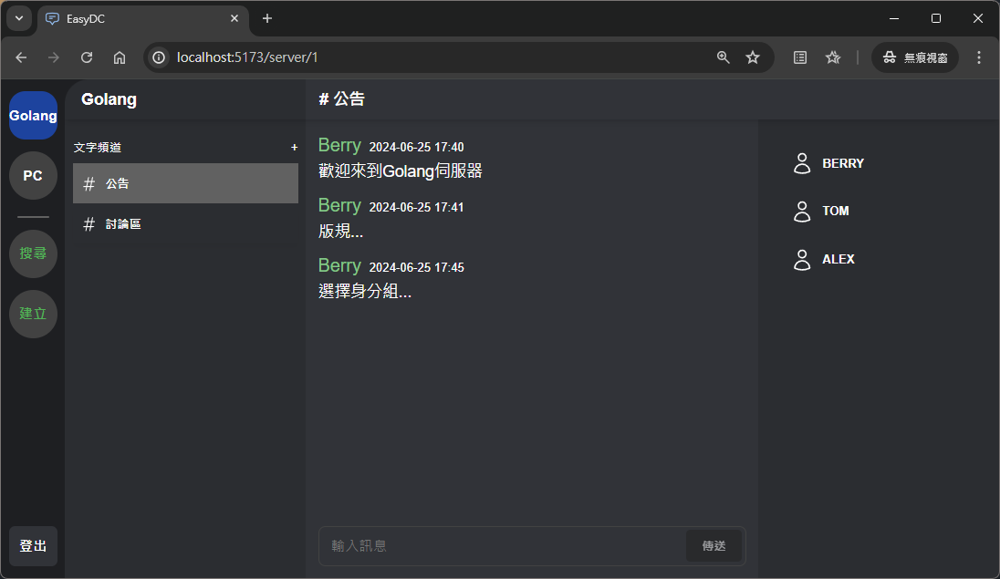
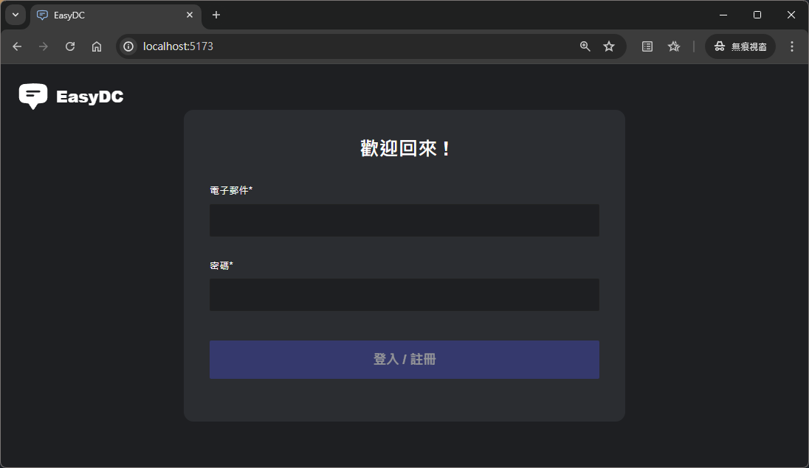
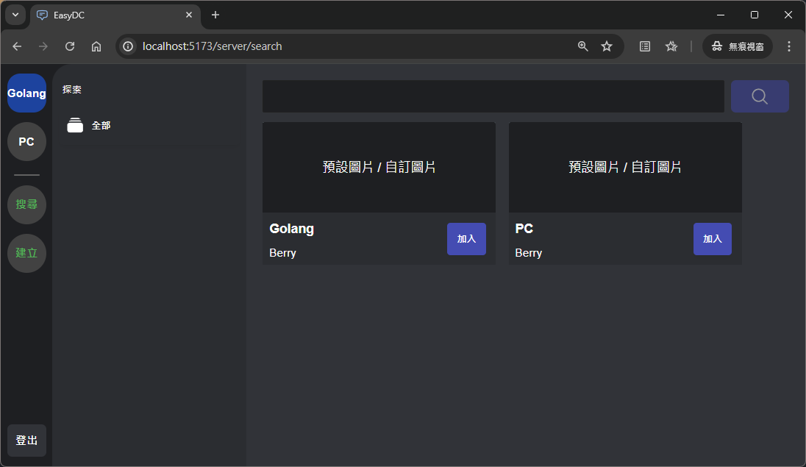
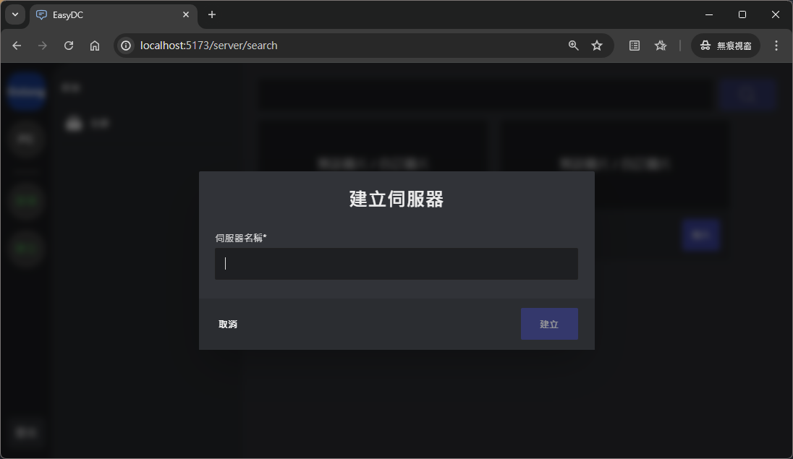
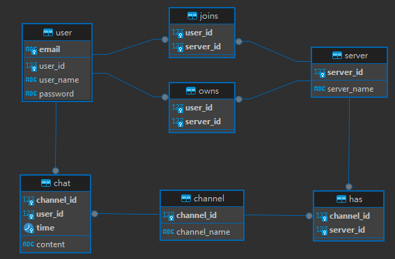

# EasyDC - Easy Discord (Golang, React Tailwind)

## 簡介

簡易版的 Discord，前端與後端透過 RESTful API 請求接收，SQL 驅動使用 MaridDB，首次搭建環境可以使用專案底下的[Migration File](./server/db/migrations/20240703114440_add_schema_tables.up.sql) UP 一次建立所需資料表。系統功能如下列表陳列，後端一項功能開發完成後先以 Postman 測試結果，確認運作正確再銜接前端。
| 功能 | Server | Client |
| ------------- | ------------- | ------------- |
| 建立使用者 | :white_check_mark: | :white_check_mark: |
| 登入 | :white_check_mark: | :white_check_mark: |
| 登出 | :white_check_mark: | :white_check_mark: |
| 建立伺服器 | :white_check_mark: | :white_check_mark: |
| 加入伺服器 | | |
| 取得使用者加入的伺服器 | :white_check_mark: | :white_check_mark: |
| 建立頻道 | :white_check_mark: | |
| 取得伺服器頻道 | :white_check_mark: | :white_check_mark: |
| 取得伺服器成員 | :white_check_mark: | :white_check_mark: |
| 傳送訊息 | :white_check_mark: | |
| 取得頻道訊息 | :white_check_mark: | :white_check_mark: |

### 網站結構(JSX Component)

    |───EasyDC
    |   |───登入
    |   |───後臺平台（Platform）
    |       |───SideBar
    |       |───新使用者引導（無伺服器）
    |       |───DC伺服器
    |           |───頻道列表
    |           |───聊天室
    |           └───成員列表
    |   |─── 搜尋伺服器
    |   |─── 伺服器類別
    |   └─── 搜尋結果
    └───────|─── 建立伺服器

### 後端應用技術

1. Service Repository Pattern(SRP)架構
2. JWT 驗證
3. Gin context(JSON)、WebSocket、Goroutine

## 預覽畫面

| 登入                                                | 搜尋伺服器                                                        | 建立伺服器                                                        |
| --------------------------------------------------- | ----------------------------------------------------------------- | ----------------------------------------------------------------- |
|  |  |  |

## Database Schema

